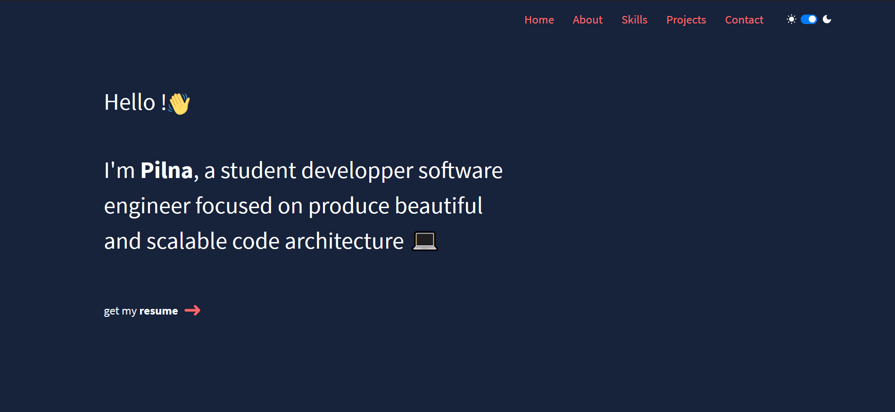
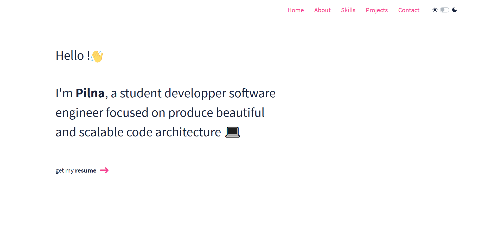

<h2 align='center'>
    My portfolio 🥳
</h2>

    <h4>
        - technologies used 🔧:    
    </h4>
    

    
    
    
    

    Here you can find my portfolio. it's a website who present my different projects and my differents technologies. However you can find some information about me and also some way to contact me.

<h4>
    - deskop preview 💻:
</h4>

    
    

